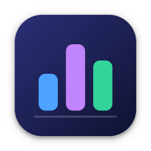
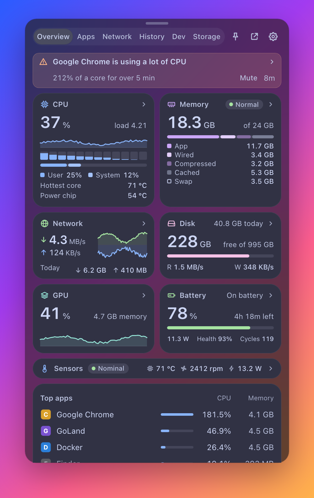
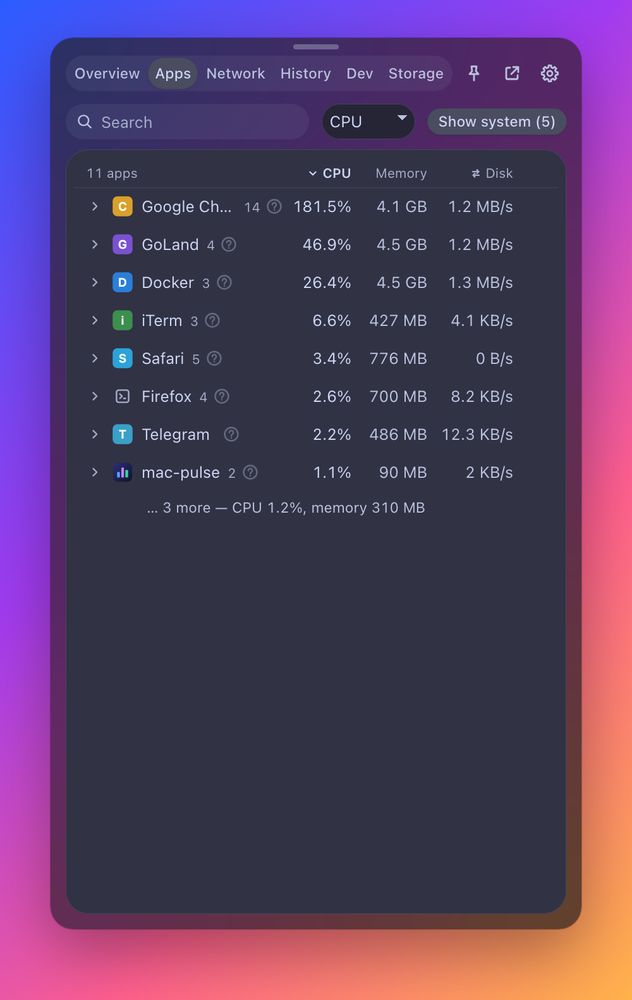
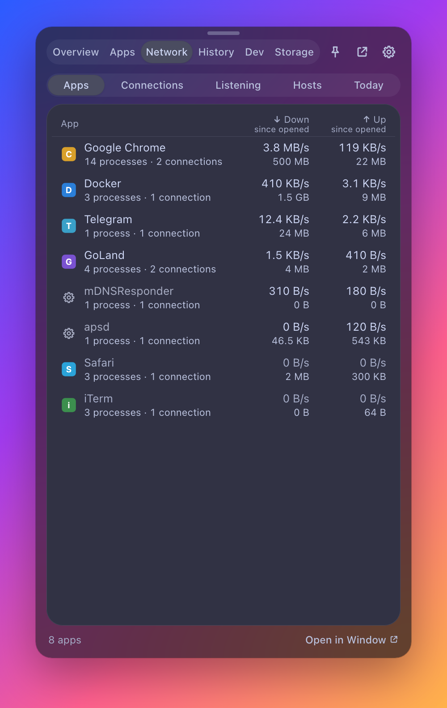
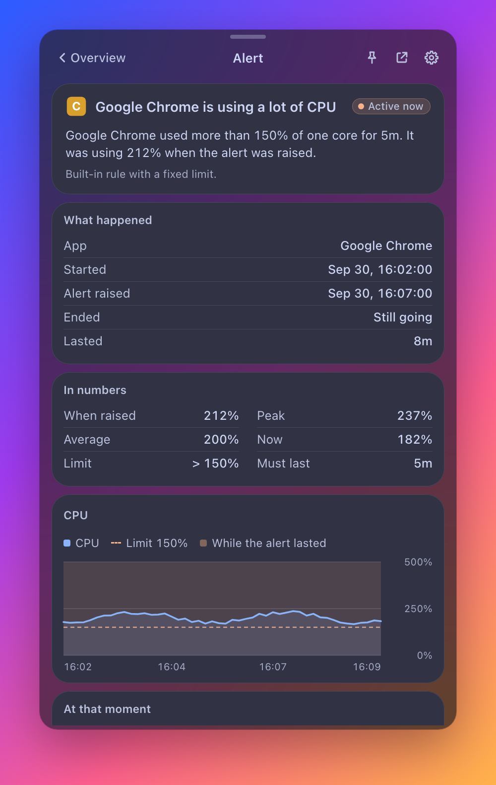
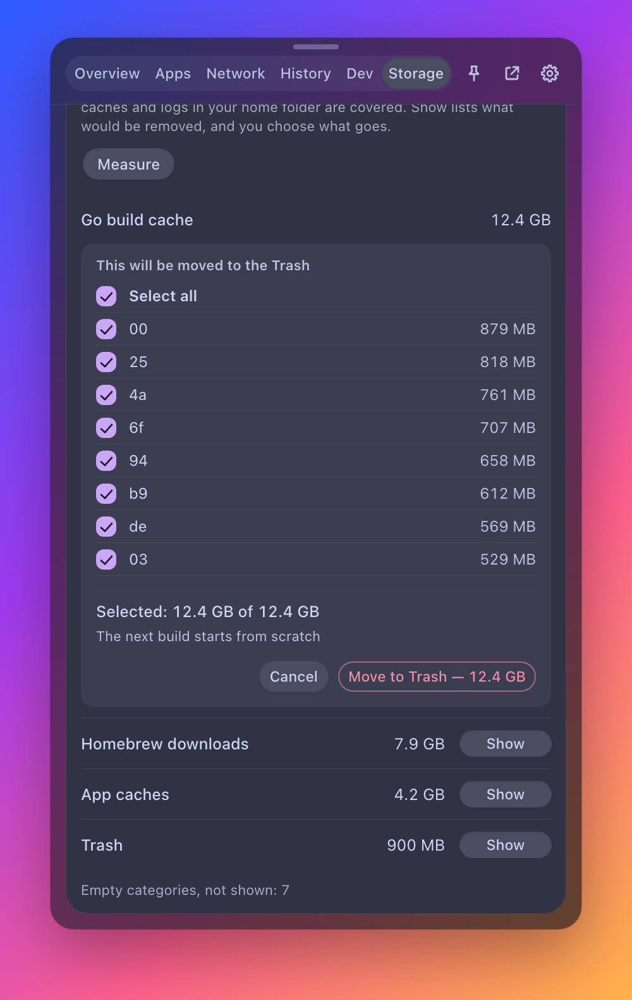
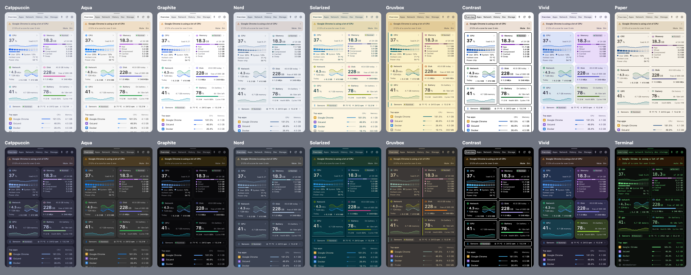
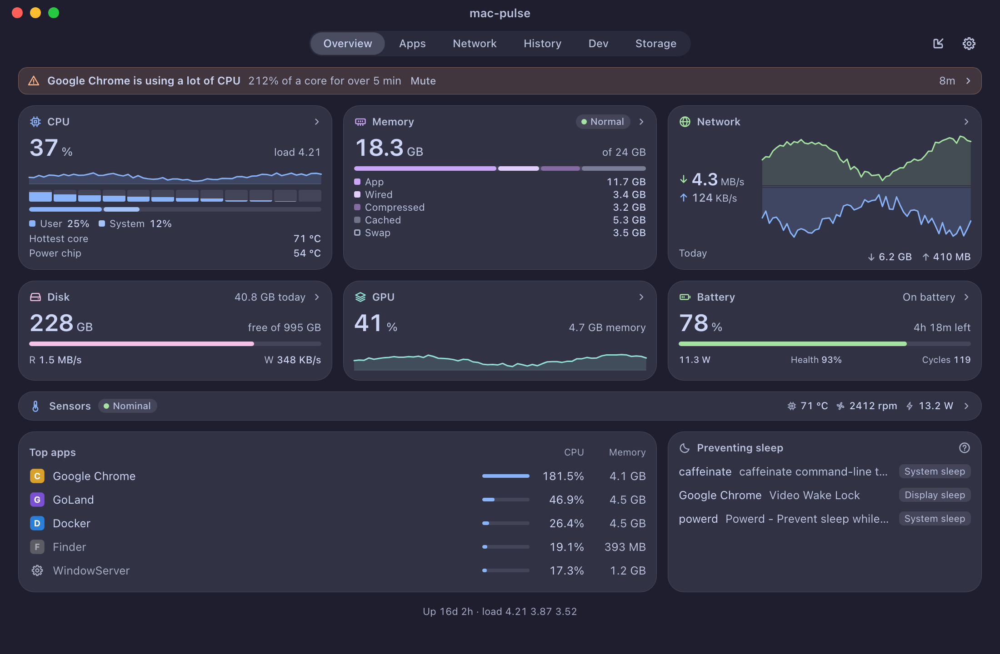

<p align="center">
  
</p>

<h1 align="center">mac-pulse</h1>

<p align="center">
  A free, open-source system monitor for the macOS menu bar, with a network inspector.<br>
  No root, no helper, no telemetry.
</p>

<p align="center">
  <a href="https://github.com/kl09/mac-pulse/releases/latest"></a>
  <a href="https://github.com/kl09/mac-pulse/actions/workflows/ci.yml"></a>
  
  
  <a href="LICENSE"></a>
</p>

<p align="center">
  
</p>

mac-pulse shows what your Mac is doing: CPU, memory, disk, network, GPU, battery, fans, temperatures
and power; which app uses what; which app talks to which host; a year of history; alerts that explain
themselves; and a map of what fills your disk.

## Contents

[Install](#install) ·
[Features](#features) ·
[What it does not do](#what-it-does-not-do) ·
[Permissions](#permissions) ·
[Privacy](#privacy) ·
[Using it](#using-it) ·
[For developers and automation](#for-developers-and-automation) ·
[Build from source](#build-from-source) ·
[How it works](#how-it-works) ·
[FAQ](#faq) ·
[Contributing](#contributing) ·
[Licence](#licence)

## Install

**Requirements:** macOS 13 Ventura or later on Apple Silicon. The 1.0.0 download is arm64 only.
Intel Macs are untested: a universal build compiles (`make universal`) and its x86_64 half starts
under Rosetta, but nobody has run it on Intel hardware, where the sensors differ.

1. Download `mac-pulse-<version>-arm64.dmg` from the [latest release](https://github.com/kl09/mac-pulse/releases/latest).
2. Open it and drag **mac-pulse** to **Applications**.
3. Open mac-pulse. **The app is not notarized by Apple yet**, so macOS refuses the first time. Allow it in one of three ways:
   - Open **System Settings → Privacy & Security**, scroll to the message about mac-pulse and press **Open Anyway**. This works on every supported macOS.
   - On macOS 13 and 14 only: right-click (Control-click) the app in Finder, choose **Open**, then **Open** again.
   - Or remove the quarantine mark in Terminal:
     ```sh
     xattr -dr com.apple.quarantine /Applications/mac-pulse.app
     ```

You only do this once. The SHA-256 of every download is in `SHA256SUMS.txt` on the release page.

<!-- Homebrew: planned, not available yet. Homebrew's main cask repository only accepts notarized apps.
     brew install --cask mac-pulse -->

To update, download the new release and replace the app; **Settings → General → Check for updates**
tells you whether there is one. To uninstall, see [Privacy](#privacy) for the files to remove.

## Features

| | |
|---|---|
|  |  |
| **Apps**: CPU, memory, disk and energy per app | **Network**: who is talking, to whom, on which port |
|  |  |
| **Alerts** say why they fired and what you can do | **Storage**: a reviewed cleanup that moves items to the Trash |

**Menu bar**
- CPU, memory, network, temperature, battery and free disk space, in the order you choose, as text or small graphs.
- Optionally one menu bar item per metric, and a clock with a month calendar and up to eight world clocks.

**Overview and detail screens**
- One tile per subsystem; each opens a detail screen: CPU (per core, clusters, frequency, power), GPU, Memory (pressure, swap), Disk (volumes, per-app I/O), Network, Battery (health, cycles, adapter), Sensors (fans, temperatures, Bluetooth battery levels).
- Shows when the microphone or camera is in use, and which apps keep the Mac awake.
- Every detail screen has **Copy stats** and **Save image**.

**Apps and processes**
- Sort by CPU, memory, disk or energy; apps are grouped with their helper processes.
- Quit, Force Quit, or send a signal. A "?" on every row says what the app or system process is.
- Browsers are broken down into tabs, extensions and graphics processes; tab titles on request.

**Network inspector**
- Per-app rates, open connections with host names, listening ports and today's totals per app.
- Public IP, ping and a speed test, each only when you press its button.

**History**
- Up to a year of CPU, memory, network, disk, GPU, temperature and battery; top apps per hour for 30 days. CSV export.

**Alerts**
- macOS notifications for CPU, temperature, thermal state, disk space, battery, memory, swap, a runaway app, a low Bluetooth device.
- Your own rules: an app above so much CPU or memory for so many minutes.
- Each alert opens a screen with the reason, the numbers, a chart with the limit and what the Mac was doing.

**Storage map and cleanup**
- A map and a list of what fills a folder. Names and sizes only; file contents are never read.
- Cleanup of eleven well-known cache locations (app caches, logs, Xcode DerivedData, simulator, npm, Yarn, pnpm, pip, Homebrew, Go build cache, Trash). You review every item first; items go to the Trash, not away.

**Developer tab**
- Local servers grouped by project folder with their ports, AI coding agent sessions (`codex`, `aider`, `gemini`, `cursor-agent`, `opencode`) and running Docker containers.

**Themes and languages**
- Ten themes, light and dark: Catppuccin (default), Aqua, Graphite, Nord, Solarized, Gruvbox, Contrast, Vivid, Paper (light only), Terminal (dark only).
- Twelve languages: English, Deutsch, Español, Français, Italiano, Português (Brasil), Русский, Українська, 日本語, 한국어, 简体中文, 繁體中文.

<p align="center">
  
</p>

**Window mode**
- The panel can be detached into a regular resizable window, optionally always on top and with a Dock icon.

<p align="center">
  
</p>

More screenshots: [CPU detail](docs/screenshots/cpu.png), [Settings → Appearance](docs/screenshots/appearance.png).

## What it does not do

- **No root, no privileged helper, no kernel or network extension.** mac-pulse runs as you and reads only what macOS lets an ordinary process read. The cost: no fan control, no blocking of connections, no per-app GPU usage, and per-app disk and energy figures only for your own processes.
- **No telemetry, no analytics, no account, no automatic update.**
- **No listening socket.**
- **No network requests on its own.** mac-pulse talks to the internet only when you ask:

  | You press | What is sent |
  |---|---|
  | Network detail → **Show** (public IP) | one HTTPS GET to `https://1.1.1.1/cdn-cgi/trace` |
  | Network detail → **Ping** | `ping -c 1 1.1.1.1` |
  | Network detail → **Run** (speed test) | one run of the system's `networkQuality` against Apple's servers (about 200 MB) |
  | Settings → General → **Check for updates** | one HTTPS GET to `https://api.github.com/repos/kl09/mac-pulse/releases/latest`; nothing is downloaded or installed |

  One more thing reaches the network: while the **Network tab is open**, host names for the addresses on screen are looked up by reverse DNS through your system resolver. The Dev tab runs the local `docker` CLI and never contacts a remote Docker context.

## Permissions

mac-pulse asks for nothing at launch. macOS asks when you use a feature that needs it:

| macOS asks for | When | If you refuse |
|---|---|---|
| Desktop, Documents, Downloads | a storage scan that reaches them; Save image and Export CSV write to the Desktop | those folders are listed as "no access"; exports go to `~/Pictures/mac-pulse` |
| Automation (control of a browser) | you press **Show tab titles** in the Apps tab | no tab titles |
| Notifications | alerts | alerts are shown only in the panel |

Never requested: Microphone, Camera, Location, Calendars, Accessibility, Full Disk Access.

## Privacy

Everything stays on your Mac. What mac-pulse writes:

- `~/Library/Application Support/mac-pulse/` (readable only by you)
  - `history.gob`: 30 days of per-minute averages, a year of per-hour averages, 30 days of hourly top apps (names and `.app` paths), today's counters;
  - `settings.json`: your settings, muted apps and app rules;
  - `lock`: the single-instance lock.
- `~/Library/LaunchAgents/com.kl09.mac-pulse.plist`, only while **Launch at login** is on.
- Preferences (`defaults read com.kl09.mac-pulse`): the menu bar item positions and the panel's place and size.
- Files you export yourself (images, CSV) on the Desktop or in `~/Pictures/mac-pulse`.

Not stored: public IP, ping, speed test and update check results, a storage scan, a cleanup measurement, tab titles, command lines.

To remove every trace: quit mac-pulse, turn off Launch at login first (or delete the LaunchAgent file), delete the app and the folder above, and run `defaults delete com.kl09.mac-pulse`.

## Using it

- **Open and close.** Click the menu bar item. Esc, a click outside, or the item again closes the panel. The pin in the header keeps it open.
- **Right-click** the menu bar item: Open in Window, Export as Image, Settings…, Reset panel position, Exit.
- **Move and resize.** Drag the panel by the grabber at the top; resize it from an edge or a corner. It reopens where you left it. "Reset panel position" puts it back under the menu bar item.
- **Notched MacBooks.** macOS hides menu bar items that do not fit left of the notch. Cmd-drag the item to the right, or shorten the list in Settings → Menu bar.
- **Settings** (the gear): General, Appearance, Menu bar, Tabs and tiles, Alerts, Keyboard shortcuts. Changes apply at once.

| Shortcut | Action |
|---|---|
| ⌘1 … ⌘6 | open a tab by its position |
| ⌘, | Settings |
| ⌘F | search in Apps |
| ⌘[ | back |
| Esc | close a hint or question, go back, then close the panel |
| ⌃⌥P (global, off by default) | show or hide the panel |
| ⌃⌥K (global, off by default) | open Apps with the quit question for the app using the most CPU |

## For developers and automation

**Links.** `open 'mac-pulse://open?tab=<tab>'` shows the panel on a tab: `overview`, `processes`, `network`, `history`, `dev`, `storage`, `settings`, `settings:<section>` (`general`, `appearance`, `menubar`, `layout`, `alerts`, `shortcuts`), `detail:<screen>` (`cpu`, `gpu`, `memory`, `disk`, `network`, `battery`, `sensors`, `clock`, `alert`). A link can only open a tab: it cannot quit, clean, scan or change a setting. Links work with the installed app, not with a bare binary.

**Command line.** The binary inside the app prints JSON and exits:

```sh
/Applications/mac-pulse.app/Contents/MacOS/mac-pulse -json              # one full state
/Applications/mac-pulse.app/Contents/MacOS/mac-pulse -storage ~/Projects # top level of a folder scan
/Applications/mac-pulse.app/Contents/MacOS/mac-pulse -caches            # cleanup categories and sizes; removes nothing
```

**MCP.** `mac-pulse mcp` is a [Model Context Protocol](https://modelcontextprotocol.io) server on stdin/stdout for an AI client on the same Mac. It opens no socket and exits when stdin closes. Tools: `summary`, `top_apps` (`metric`: `cpu` or `memory`, `n`: 1–20) and `history` (`metric`, `range`: `1h` … `1y`).

```json
{"mcpServers": {"mac-pulse": {"command": "/Applications/mac-pulse.app/Contents/MacOS/mac-pulse", "args": ["mcp"]}}}
```

## Build from source

You need macOS 13 or later, the Xcode Command Line Tools (`xcode-select --install`) and Go 1.26.8 or later.

```sh
git clone https://github.com/kl09/mac-pulse.git
cd mac-pulse
make build     # bin/mac-pulse, a bare binary for development
make run       # build and start it
make test      # go test -race ./...
make lint      # gofumpt, golangci-lint, C and Objective-C warnings as errors
make bundle    # dist/mac-pulse.app, ad hoc signed
make install   # copy the bundle to ~/Applications
make dmg       # dist/mac-pulse-<version>-arm64.dmg
```

A build of your own is signed on your Mac and is not quarantined, so Gatekeeper does not object.
[CONTRIBUTING.md](CONTRIBUTING.md) covers the layout of the code, the mock mode for UI work and how to add a language or a theme. [docs/RELEASING.md](docs/RELEASING.md) covers releases, signing and notarization.

## How it works

**Three parts in one binary.** A Go core samples the system and keeps the history. A small Objective-C shell, compiled in through cgo, owns the menu bar items, the panel and a WKWebView. The panel itself is plain HTML, CSS and JavaScript with no framework and no build step, embedded in the binary and loaded from memory; the web view is created the first time you open the panel. The page and the core exchange JSON messages; the page has no network access of its own.

**Data sources.** CPU, memory, disk and interface counters come from the usual kernel interfaces (through [gopsutil](https://github.com/shirou/gopsutil)); per-process figures from `libproc`; battery from `ioreg`; per-app network traffic from the system's `nettop`; fans, temperatures and system power from the SMC; CPU and GPU power and cluster frequencies from IOReport; GPU utilisation from the IOKit registry. Collectors for a detail screen run only while that screen is open.

**Private interfaces.** The SMC and IOReport are not documented by Apple, but they are the only way to read sensors and power without root. They are read-only and reached through system libraries; no Apple code is copied. The sensor names differ between chips, and any of these sources may stop answering after a macOS update. When that happens the reading shows `—` or "Unavailable", never a made-up zero. If you see that on a new Mac or a new macOS, please [open an issue](https://github.com/kl09/mac-pulse/issues/new/choose).

## FAQ

**Why does macOS warn me when I open the app?**
The release is signed ad hoc and not notarized by Apple, which requires a paid developer account. See [Install](#install) for how to allow it. You can also [build it yourself](#build-from-source).

**Why is a fan "Off"?**
Because it is. Apple Silicon Macs stop their fans completely when cool, and the SMC then reports 0 rpm. A MacBook Air has no fan at all and shows "No fans reported on this Mac".

**Why does the CPU temperature differ from other tools?**
There is no single "CPU temperature" on Apple Silicon. mac-pulse shows two: **Hottest core**, the hottest of the core sensors, and **Power chip**, the die sensor of the power management chip, which runs cooler. The menu bar, the history and the temperature alert use the power chip reading, because it is cheap to read on every sample; the core sensors are read while a screen that shows them is open. Other tools usually show the hottest core or an average. Sensors lists every temperature mac-pulse can read.

**Why is an app listed under "System"?**
System processes are other users' processes, anything under `/System/Library`, `/usr/libexec`, `/usr/sbin`, `/sbin` and `/Library/Apple`, and macOS's own extensions. They are hidden behind "Show system" and cannot be quit from mac-pulse. Command-line tools from `/usr/bin` and `/bin` count as yours only when started from a terminal.

**Why do the per-app network totals not add up to the interface totals?**
Per-app traffic is sampled from `nettop`, which counts a socket only while it is open: short connections can be missed. The interface totals on Overview count everything.

**Why is there no Wi-Fi network name?**
macOS gives it only to apps with the Location permission, which mac-pulse does not ask for.

**How much does it use itself?**
About 70 MB of memory until the panel is first opened; the web view and its helper processes add roughly 115 MB after that and stay until you quit mac-pulse.

**Does it work on Intel Macs?**
Untested. See [Install](#install).

## Contributing

Bug reports, fixes, translations and themes are welcome: see [CONTRIBUTING.md](CONTRIBUTING.md). For a security problem, follow [SECURITY.md](SECURITY.md) and do not open a public issue. Changes are listed in [CHANGELOG.md](CHANGELOG.md).

## Licence

[MIT](LICENSE). Third-party licences are in [THIRD-PARTY-NOTICES.md](THIRD-PARTY-NOTICES.md).

## Acknowledgements

- [gopsutil](https://github.com/shirou/gopsutil) and [purego](https://github.com/ebitengine/purego).
- The [Catppuccin](https://github.com/catppuccin/catppuccin), [Nord](https://github.com/nordtheme/nord), [Solarized](https://github.com/altercation/solarized) and [gruvbox](https://github.com/morhetz/gruvbox) palettes. The themes named after them are adjusted for contrast and are not the canonical colours.
